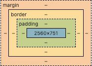
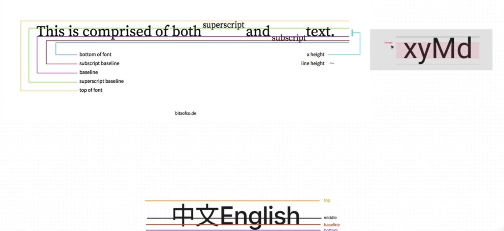

# CSS样式（整个前端中非常非常重要的部分）

（暂时只做重要部分或者未掌握部分的笔记，非系统性笔记）

CSS（Cascading Style Sheets，层叠样式表）是一种用来表现HTML或XML文档样式的语言。CSS描述了HTML或XML文档中元素的外观和版式。CSS可以控制网页的字体、颜色、大小、边框、背景、边距等多种外观和版式。CSS3是CSS的最新版本，新增了很多特性，使得CSS更加强大和灵活。

CSS的语法非常简单，基本上就是选择器、属性和值。选择器用于指定HTML元素，属性和值用于设置元素的样式。CSS可以直接写在HTML文档的head标签中，也可以写在外部的CSS文件中，然后通过link标签链接到HTML文档中，还可以写在标签的style属性中。优先级为：style > head标签 > 外部css文件（离得越近越重要，包括写在head标签和外部css文件中的部分，后来的属性会覆盖前面的属性）。

## 盒子模型

css的学习一般从盒子模型开始，盒子模型一般打开浏览器的开发页面，在元素的style最下方也能看到选定元素的盒子模型。

****

如上图，从内到外分别是内容、内边距、边框、外边距，CSS样式主要就是用来设定这几个属性的样式。

说明<font color="red">*</font>：平时设置的width默认设置的是内容的宽度，所以实际的宽度为`外边距+边框宽度+内边距`，但是width默认设置的宽度可以通过`box-sizing`属性来设置将边框和内边距包含在width内。主要使用的有三个属性值：`content-box`（默认），设置的是内容的宽度；`border-box`，设置的是边框的宽度（包括边框自己的宽度）。height同理。

## 图片文件类型样式

| 文件类型 |    一般用途    |                             说明                             |
| :------: | :------------: | :----------------------------------------------------------: |
|  `.jpg`  |    展示图片    |             文件相对较小，有损压缩，不支持透明度             |
|  `.png`  | 图标、展示图片 |              文件相对较大，无损压缩，支持透明度              |
|  `.gif`  |      图标      |    文件尺寸大，简单动态图形，色彩范围较窄，不适合复杂图像    |
|  `.svg`  |      图标      | 矢量格式，无损任意缩放，支持动态效果，支持透明度，复杂图像文件尺寸偏大 |
| `.webp`  | 展示图片、图标 | 支持透明度和动画，支持无损和有损压缩，图片质量比jpg好，文件大小比png小得多 |

## 颜色表示方法

* 关键字：red、green等
* 十六进制：`#000`、`#000000`都表示纯黑，注意，出了RGB的值，还有第四位为不透明度，可选。
* RGB/RGBA：rgb(r, g, b, a)，前三位为0~255的RGB值，第四位为不透明度，范围为`0~1`，0表示完全透明，1表示不透明，可选。
* HSL/HSLA：即Hue（色相）、Saturation（饱和度）、Lightness（亮度），H的取值范围为`0~360`，是一个色环，S和L取值范围为`0~100%`，A仍是不透明度，例：`hsl(11, 100%, 60%, 0.2)`。

## 字体

字体注意尽量不要引入外部字体，使用各家系统内置的字体最好，这样能最大限度减少资源的下载，确保系统正常运行，为次一般会在`<main>`甚至是`<body>`标签上加一个配置：

```html
<style>
  body {
      font-family: system-ui, -apple-system, BlinkMacSystemFont, 'Segoe UI', Roboto, Oxygen, Ubuntu, Cantarell, 'Open Sans', 'Helvetica Neue', sans-serif;
  }
</style>
```

加上该配置后，当应用在系统中打开时，它首先会去使用系统默认的字体（`system-ui`），如果没找到，则会顺次往后找，如果一直没找到，则最终以浏览器的默认无衬线字体（`sans-serif`）打底。

大规模显示的字体一定要使用无衬线体（sans serif），衬线体增加了类似于笔风一样的东西，不利于大规模阅读，但是其艺术性，适合用作标题、Logo等元素的字体。

* `MacOS`、`iOS`默认无衬线中文字体为苹方，默认衬线中文字体为`STSong`，默认英文字体为`San Francisco`
* `Windows`默认无衬线中文字体为`Microsoft YaHei`（微软雅黑，版权杀手🥷），默认衬线中文字体为`SimSum`，默认英文字体为`Segoe UI`
* `Android`默认无衬线中文字体为思源黑体，默认英文字体为`Roboto`，国内个手机厂商大都有自己定制的字体，不一定遵循这个设置。

字体几个常用属性：

* `color`：字体颜色
* `font-size`：字体大小，单位有em、rem、px、cm、ich等
* `font-weight`，字重，一般越大字体越粗
* `font-style`：斜体
* `line-height`：行高
* `text-decoration`：装饰
* `text-transform`：转换
* `letter-spacing`：字符间距
* `word-spacing`：单词间距
* `text-indent`：缩进
* `text-shadow`：文字投影
* `font-display`：控制字体加载过程中什么时候显示，以及用什么字体显示，有三个值
  * `block`：有较长文字不显示的事件，比如3秒后字体才加载完也会切换
  * `swap`：文字立即显示默认，字体加载完会切换为加载字体
  * `fallback`：极短时间内文字不显示，比如100毫秒，如果在几秒内加载玩，还是会切换显示，如果字体加载时间过长就不会切换了

## 文字换行与溢出处理

`white-space`属性值的行为：

|    关键字    | 换行符 | 空格和制表符 | 文本换行 | 行末空格 | 行末的其他空白分隔符 |
| :----------: | :----: | :----------: | :------: | :------: | :------------------: |
|    normal    |  合并  |     合并     |   换行   |   移除   |         挂起         |
|    nowrap    |  合并  |     合并     |  不换行  |   移除   |         挂起         |
|     pre      |  保留  |     合并     |  不换行  |   保留   |        不换行        |
|   pre-wrap   |  保留  |     保留     |   换行   |   挂起   |         挂起         |
|   pre-line   |  保留  |     合并     |   换行   |   移除   |         挂起         |
| break-spaces |  保留  |     保留     |   换行   |   换行   |         换行         |

单词截断：`word-break: break-all`，设定后，右边尽量截断填满；`overflow-wrap: break-word`，设置后，也能截断，但是会尽可能保留最长的样子，具体使用的时候可以轮番设置对比一下，取合适的即可。

文字溢出：需要父元素有固定的尺寸并且`white-space`设置了不换行才能出现文字溢出的情况。`overflow: hidden; text-overflow: ellipsis;`设置后，溢出则显示省略号。

文字对齐：

* 水平方向对齐，`text-align`，只对 **块级元素内的文字** 或 **行内元素** 起作用，属性值作用见名知意即可

  ```css
  text-align: start;
  text-align: end;
  text-align: left;
  text-align: right;
  text-align: center;
  text-align: justify;
  ```

* 行内/表格元素纵向对齐，`vertical-align`

  对齐空间说明：每一行文字都形成了自己行内独立空间，如下图：
  ****

所以`vertical-align`有如下值：
```css
/* 关键字值 */
vertical-align: baseline;
vertical-align: sub;
vertical-align: super;
vertical-align: text-top;
vertical-align: text-bottom;
vertical-align: middle;
vertical-align: top;
vertical-align: bottom;

/* <length> 值 */
vertical-align: 10em;
vertical-align: 4px;

/* <percentage> 值 */
vertical-align: 20%;

/* 全局值 */
vertical-align: inherit;
vertical-align: initial;
vertical-align: revert;
vertical-align: revert-layer;
vertical-align: unset;
```

## 边框背景

宽高、普通的border、border-radius略，介绍一下border-image的几个属性。`border-image: src slice width repeat`，虽然用的很少，但是聊天气泡需要确保背景图伸缩不变形时需要用到。

背景：background、background-clip、background-color、background-image、background-repeat、background-origin、background-position、background-size、background-attachment等几个属性。

渐变背景：background/background-image都可以实现，主要有三个参数实现，分别是线性渐变linear-gradient()、径向渐变radial-gradient()、锥形渐变conic-gradient()。其余为这三个的变种repeating-linear-gradient()、repeating-radial-gradient()、repeating-conic-gradient()。
